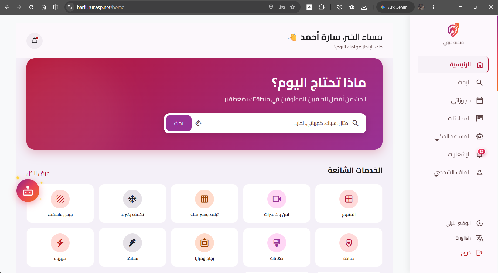
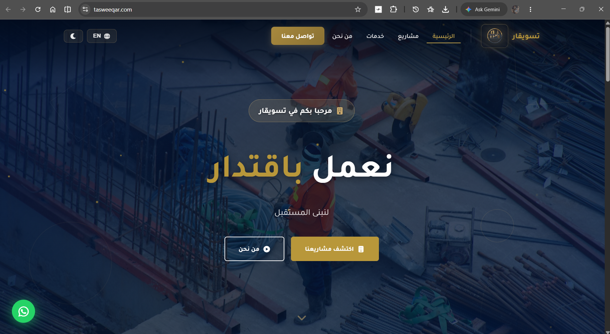

# Esraa Shiref Portfolio

> A production-grade personal portfolio built with Angular 21, Three.js, and GSAP — featuring an interactive 3D character, smooth scroll animations, and a comprehensive showcase of full-stack projects.

[](https://angular.dev)
[](https://www.typescriptlang.org)
[](https://threejs.org)
[](https://gsap.com)
[](LICENSE)

---

## Table of Contents

- [Overview](#overview)
- [Key Features](#key-features)
- [Tech Stack](#tech-stack)
- [Demo & Screenshots](#demo--screenshots)
- [Getting Started](#getting-started)
- [Project Structure](#project-structure)
- [Available Scripts](#available-scripts)
- [Deployment](#deployment)
- [Contributing](#contributing)
- [License](#license)
- [Contact](#contact)

---

## Overview

This is the personal portfolio of **Esraa Ahmed Shiref**, a Full-Stack Developer from Cairo, Egypt. The site showcases her work across Angular, React Native, and ASP.NET Core — presented through an immersive 3D experience complete with an interactive character, scroll-driven animations, and a clean, responsive layout.

Originally ported from a React + Three.js template to Angular 21 with standalone components and signals.

---

## Key Features

- **Interactive 3D Character** — An encrypted GLTF model loaded with DRACO decompression, featuring head-tracking that follows mouse/touch input and GSAP-powered scroll-driven camera + character animations.
- **Lenis Smooth Scrolling** — Butter-smooth scroll experience with a custom easing curve, integrated with GSAP ScrollTrigger timelines.
- **Custom Text Splitter** — A bespoke utility that splits text into characters, words, or lines for scroll-triggered reveal animations (replaces GSAP SplitText).
- **Loading Screen** — Progress-simulated loading overlay with marquee text that transitions into the main experience once the 3D model and assets are ready.
- **Portfolio Showcase** — Dedicated `/myworks` page listing five real projects with descriptions, tech stacks, and images.
- **Responsive Sections** — Landing, About, What I Do, Career timeline, horizontal pinned-scroll Work section, Tech Stack badges, Call to Action, Contact, and social icons — all driven by a single `config.ts` data source.
- **Bilingual-Ready Architecture** — Designed with i18n-friendly patterns used in production projects (e.g., Tasweeqar).

---

## Tech Stack

| Category | Technology |
| -------- | ---------- |
| **Framework** | Angular 21 (standalone components, signals, `bootstrapApplication`) |
| **Language** | TypeScript 5.9 |
| **3D Rendering** | Three.js 0.185 + three-stdlib + DRACO loader |
| **Animations** | GSAP 3.15 (ScrollTrigger, Timeline) |
| **Smooth Scroll** | Lenis 1.3 |
| **Styling** | SCSS with global CSS files |
| **Testing** | Vitest 4.0 + jsdom |
| **Formatting** | Prettier 3.8 |
| **Build Tool** | Angular CLI (`@angular/build:application`) |

---

## Demo & Screenshots

<!-- TODO: Replace with actual screenshots or a live demo link -->

| Page | Preview |
| ---- | ------- |
| Landing + 3D Character |  |
| My Works |  |

A live demo can be found at: **<!-- TODO: add deployment URL -->**

---

## Getting Started

### Prerequisites

- [Node.js](https://nodejs.org) (v18.19 or later)
- npm 10.9+ (installed with Node.js)
- Angular CLI (optional, installed as dev dependency)

### Installation

```bash
git clone https://github.com/EsraaShiref/esraa-portfolio.git
cd esraa-portfolio
npm install
```

### Environment Variables

This project does **not** require environment variables. All portfolio content is managed through `src/app/core/config.ts`.

### Run the Development Server

```bash
npm start
```

Navigate to `http://localhost:4200`. The app automatically reloads on source file changes.

### Build for Production

```bash
npm run build
```

The production-ready files are output to `dist/esraa-portfolio/browser/`.

---

## Project Structure

```
src/
├── index.html                     # App entry HTML
├── main.ts                        # Angular bootstrap (standalone)
├── styles.scss                    # Global styles entry (imports all CSS files)
├── styles/                        # Global CSS files (17 files)
│   ├── index-base.css
│   ├── App.css
│   ├── style.css
│   ├── Cursor.css
│   ├── Navbar.css
│   ├── Landing.css
│   ├── Loading.css
│   ├── About.css
│   ├── WhatIDo.css
│   ├── TechStackNew.css
│   ├── Career.css
│   ├── Work.css
│   ├── CallToAction.css
│   ├── Contact.css
│   ├── SocialIcons.css
│   ├── MyWorks.css
│   └── Play.css
└── app/
    ├── app.ts                     # Root component
    ├── app.html                   # Root template (<router-outlet />)
    ├── app.config.ts              # App configuration & providers
    ├── app.routes.ts              # Route definitions
    ├── core/
    │   ├── config.ts              # All portfolio data (content, projects, skills, etc.)
    │   ├── services/
    │   │   ├── loading.service.ts # Loading state signals
    │   │   └── lenis.service.ts   # Lenis smooth-scroll wrapper
    │   ├── three/
    │   │   ├── data/
    │   │   │   └── bone-data.ts   # Animation bone name constants
    │   │   └── utils/
    │   │       ├── animation-utils.ts  # GLTF animation filtering & setup
    │   │       ├── character.ts        # 3D model loader & scene setup
    │   │       ├── decrypt.ts          # AES-CBC decryption for .enc models
    │   │       ├── gsap-scroll.ts      # Scroll-triggered character/camera timelines
    │   │       ├── lighting.ts         # Scene lighting & HDR environment
    │   │       ├── mouse-utils.ts      # Mouse/touch head rotation logic
    │   │       └── resize-utils.ts     # Renderer resize + timeline re-init
    │   └── utils/
    │       ├── initial-fx.ts      # Post-load intro animations
    │       ├── split-text.ts       # Scroll-triggered text splitting
    │       └── text-splitter.ts   # Custom SplitText replacement utility
    ├── components/
    │   ├── about/                 # About Me section
    │   ├── call-to-action/        # CTA banner
    │   ├── career/                # Career timeline
    │   ├── character/             # 3D character component (Three.js)
    │   ├── contact/               # Contact form / info
    │   ├── cursor/                # Custom cursor component
    │   ├── hover-links/           # Hover-effect link component
    │   ├── landing/               # Hero landing section
    │   ├── navbar/                # Top navigation bar
    │   ├── social-icons/          # GitHub, LinkedIn, email links
    │   ├── tech-stack/            # Skills & tools grid
    │   ├── what-i-do/             # What I Do section
    │   ├── work/                  # Work showcase (horizontal scroll)
    │   └── work-image/            # Work image card component
    ├── pages/
    │   ├── home/                  # Home page (assembles all sections)
    │   ├── my-works/              # Full project portfolio page
    │   └── play/                  # Placeholder interactive page
    └── shared/
        └── loading/               # Loading screen overlay component
```

---

## Available Scripts

| Script | Description |
| ------ | ----------- |
| `npm start` | Start development server at `http://localhost:4200` |
| `npm run build` | Build the project for production |
| `npm run watch` | Build in development mode with file watching |
| `npm test` | Run unit tests via Vitest |
| `npm run ng` | Invoke Angular CLI directly |

---

## Deployment

The project builds to static files in `dist/esraa-portfolio/browser/` and can be deployed to any static hosting provider:

- **Vercel** — Deploy by connecting your GitHub repository and setting the build command to `ng build` and output directory to `dist/esraa-portfolio/browser`.
- **Netlify** — Set publish directory to `dist/esraa-portfolio/browser` and build command to `npm run build`.
- **GitHub Pages** — Use `angular-cli-ghpages` or copy the build output to a `docs/` folder.

<!-- TODO: Add your specific deployment URL and platform here -->

---

## Contributing

Contributions are welcome! Since this is a personal portfolio, please open an issue or submit a pull request for any improvements or fixes.

1. Fork the repository
2. Create a feature branch (`git checkout -b feature/your-feature`)
3. Commit your changes (`git commit -m 'Add some feature'`)
4. Push to the branch (`git push origin feature/your-feature`)
5. Open a Pull Request

---

## License

This project is licensed under the [MIT License](LICENSE).

---

## Contact

**Esraa Ahmed Shiref**  
Full-Stack Developer

- **Email:** [Israashiref@gmail.com](mailto:Israashiref@gmail.com)
- **GitHub:** [@EsraaShiref](https://github.com/EsraaShiref)
- **LinkedIn:** [esraa-shiref](https://linkedin.com/in/esraa-shiref)
- **Location:** Cairo, Egypt

---

<p align="center">
  Built with Angular 21 · Three.js · GSAP · Lenis
</p>
